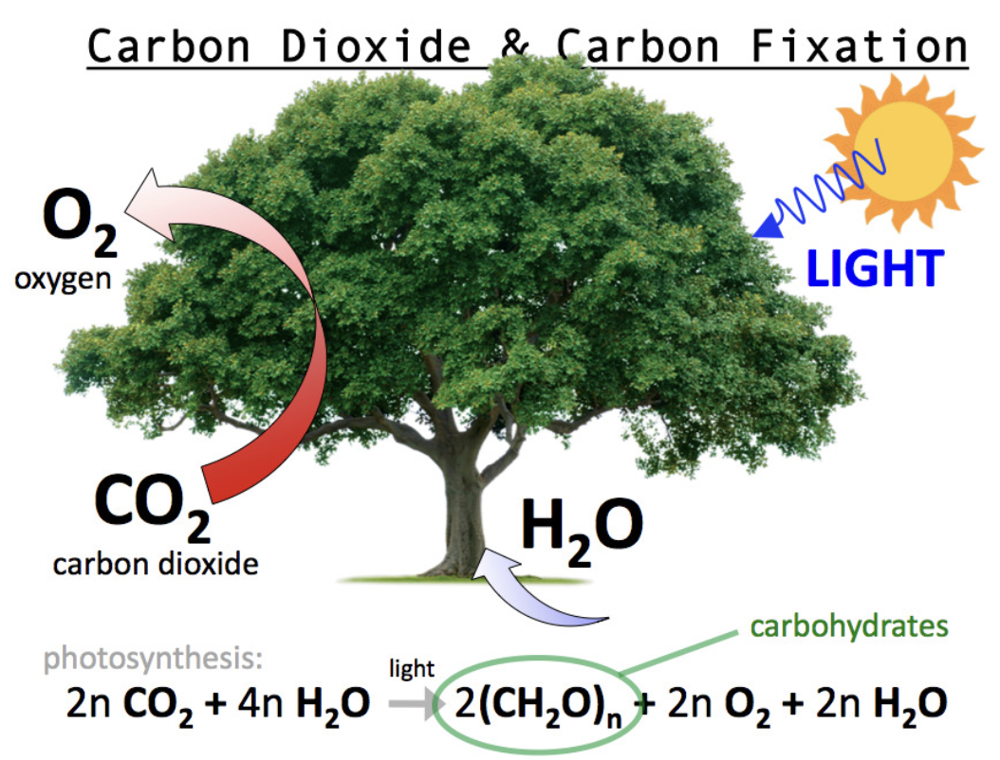
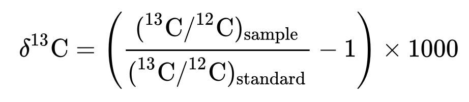
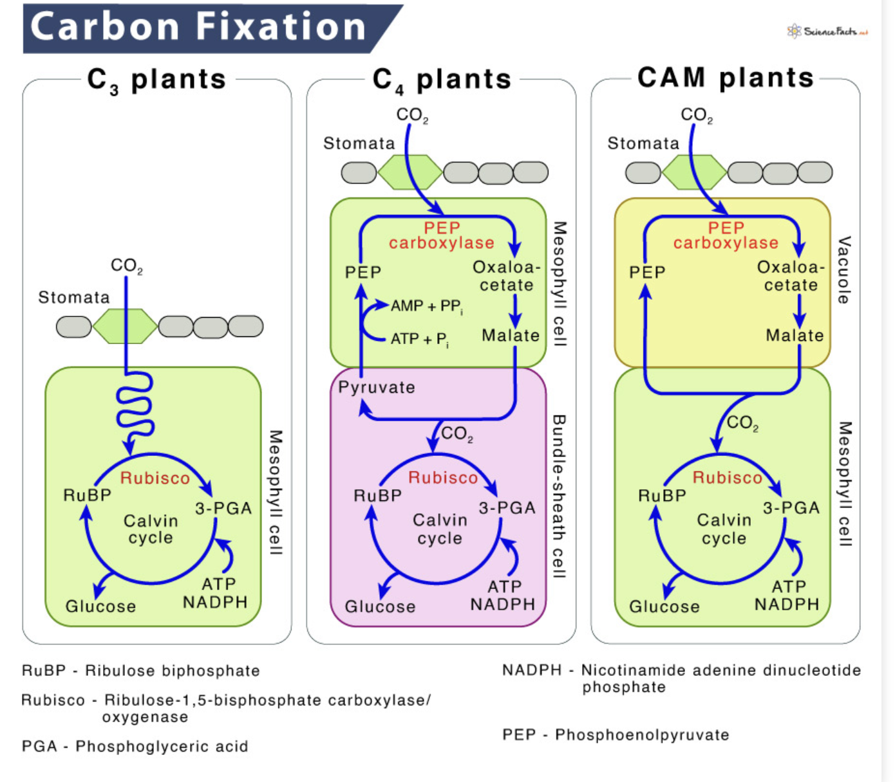

# Carbon isotope Picarro result analyzer

## Background

Carbon fixation in plants is the process of taking carbon dioxide (CO2) from the air and turning it into sugars that the plant can use for energy and growth. This happens during [photosynthesis](https://en.wikipedia.org/wiki/Photosynthesis) in the plant's leaves, and it also releases oxygen (O2) into the air. In most plants ([C3 plants](https://en.wikipedia.org/wiki/C3_carbon_fixation)), CO2 is directly used in a cycle of reactions to produce these sugars. In some plants ([C4](https://en.wikipedia.org/wiki/C4_carbon_fixation) and [CAM plants](https://en.wikipedia.org/wiki/Crassulacean_acid_metabolism)), there are extra steps that help them capture CO2 more efficiently, especially in hot and dry conditions. 

<p align="center">
  
</p>

The CO2 in the atmosphere is composed of different carbon [isotopes](https://en.wikipedia.org/wiki/Isotope), and specifically the ratio of stable isotopes 13C and 12C, expressed as δ13C: 
provides valuable insights into plant physiology and particularly drought stress. Under well-watered conditions with open [stomata](https://en.wikipedia.org/wiki/Stoma), [RuBisCO](https://en.wikipedia.org/wiki/RuBisCO) preferentially fixes the lighter 12C that diffuses a little bit faster and also has a higher affinity for the 12C isotope over 13C. This results in more negative δ13C values (higher 13C discrimination). When stomata close due to drought stress, intercellular CO2 concentrations are lower, and RuBisCO has a reduced ability to discriminate against the heavier 13C isotope during carboxylation, resulting in less negative δ13C values.

<p align="center">
  
</p>


The analysis of carbon isotopes is done with a [Picarro analyzer](https://www.picarro.com/environmental/carbon_isotope_analysis_systems) built on Cavity Ring-Down Spectroscopy (CRDS) technology. This sophisticated time-based measurement uses a laser to quantify spectral features of gas-phase molecules in an optical cavity and measures the 12C and 13C values of a sample. The Picarro provides a CSV file with the analysis, including the δ13C value, which then needs to be corrected with calibration values and a glucose standard me so:
```
(corrected) δ13C = δ13C - glucose standart mean - calibration value
```

## Goal

The goal of this project is to create an efficient and easy-to-use tool that will analyze Picarro carbon isotope composition CSV results. This tool will include the correction of δ13C values and plotting of the results. If your experiment involves different treatment and control groups, it will offer a comparative plot between these groups, along with statistical analysis. Additionally, it will search the δ13C plants database for the literature δ13C values of your plant species, providing a reference point for interpreting your results.

## Technical info

Note: The statistical analysis for 2 groups is an independent t-test; for more than 2 groups, it is a one-way ANOVA. Please ensure your data is compatible for these tests if you choose to perform the statistical analysis

1. Downloading the δ13C leaf database.
2. Importing relevant Python libraries and modules.
3. Reading the result CSV file and correcting the δ13C values.
4. Setting up a GUI to ask the user for their plant species.
5. Searching in the δ13C leaf database for the user's species δ13C value.
6. Performing statistical analysis (mean, standard deviation, median, t-test/ANOVA) on the results.
7. Setting up a GUI to ask the user whether to plot the data (including δ13C values from the database) as a single group or multiple groups.Prompting for group names else use sample IDs.
8. Printing a carbon isotope composition report including plots, statistical analysis, and δ13C values from the database.

## Installing the dependencies

The needed installations can be found in `requirements.txt`
```
pip install -r requirements.txt
```

## Testing the program

Run-
```
pytest
```

## Running the program

To run
```
python data_analyze.py
```

This project was originally implemented as part of the [Python programming course](https://github.com/szabgab/wis-python-course-2024-04) at the [Weizmann Institute of Science](https://www.weizmann.ac.il/) taught by [Gabor Szabo](https://szabgab.com/).
